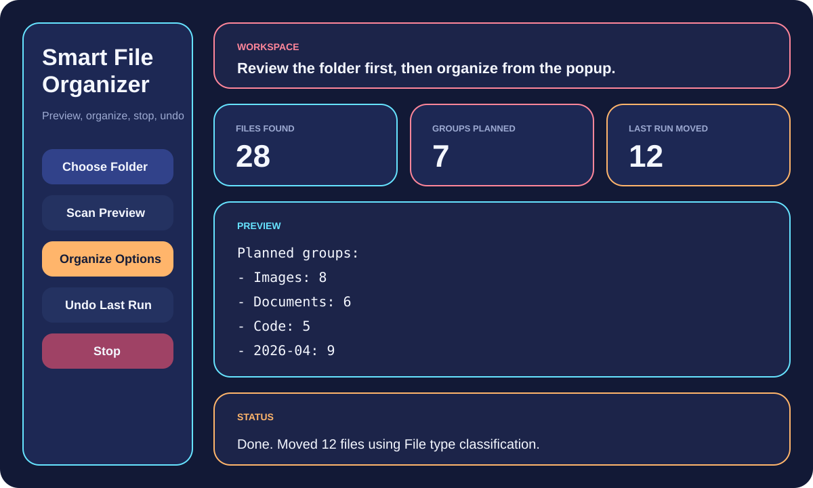
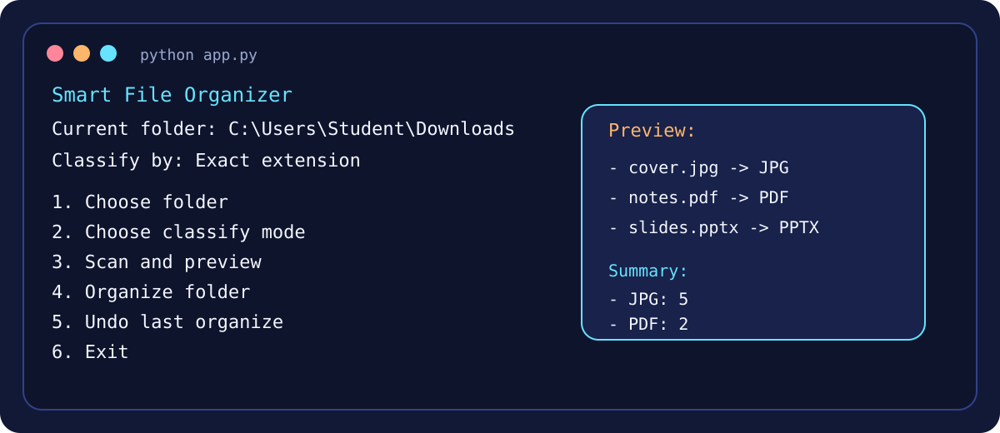

# Smart File Organizer

Small Python OOP project that sorts files in a folder and keeps the process simple to use.
It has a terminal version and a Tkinter GUI, with logging, undo, preview, and different classify modes.

## Main Features
- Scan files in a selected folder
- Classify by file type, exact extension, or modified month
- Create destination folders automatically
- Move files with `shutil.move()`
- Handle duplicate file names safely
- Save move history for undo
- Write logs with source, destination, time, and criterion
- Offer both terminal menu and Tkinter GUI
- GUI has popup options for choosing the classify mode
- GUI has start and stop controls

## How To Run
```bash
python app.py
```

For the GUI:

```bash
python gui_app.py
```

## Classify Modes
1. `type` for folders like `Images`, `Documents`, `Code`
2. `extension` for folders like `PDF`, `JPG`, `TXT`
3. `date` for folders like `2026-04`

## Basic Use
1. Open the project folder in terminal
2. Run the CLI or GUI version
3. Choose the folder you want to organize
4. Pick the classify mode
5. Start organizing
6. Use undo if you want to restore the last run

## Screenshots
### GUI Preview


### CLI Preview


## Notes
- Uses only Python standard library modules
- History is saved in `data/history.json`
- Logs are saved in `logs/organizer.log`

## Test
```bash
python -m unittest discover
```
